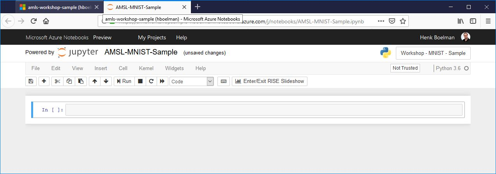
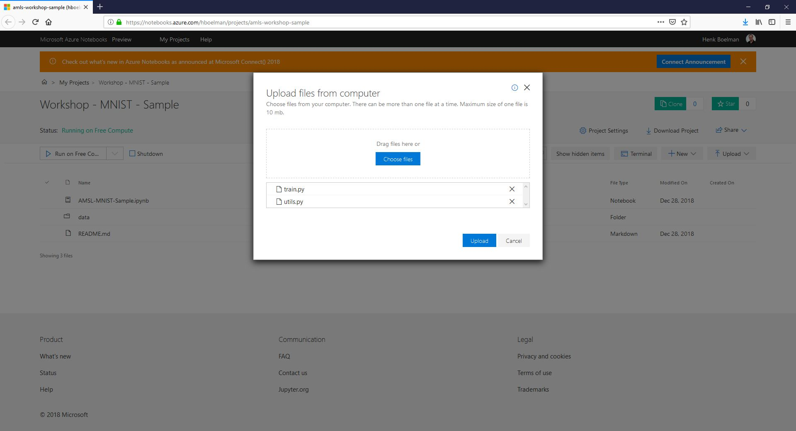
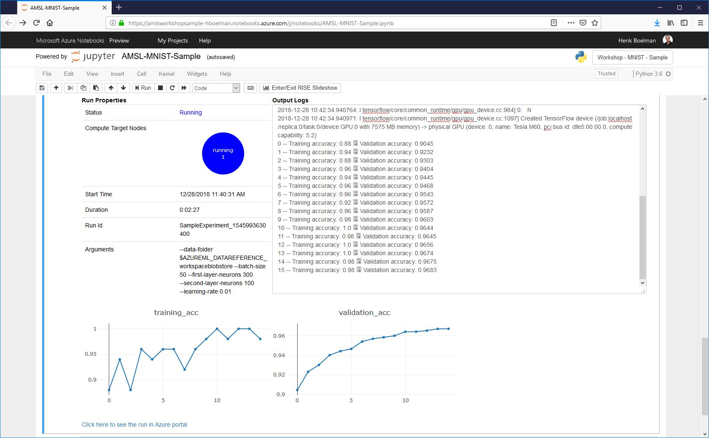
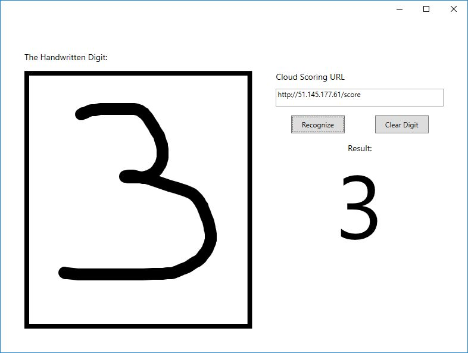

# Azure Machine Learning Service

**In this HOL you are going to use Azure Machine Learning Service and Azure Notebooks to create a MNIST model and run in in a container in Azure**

### Requirements 
- Azure Subscription

## Part 1 - Setup Azure Notebooks

### 1.1 - Create the Azure Notebook Environment
* Goto: [notebooks.azure.com](https://notebooks.azure.com/?WT.mc_id=aiml-0000-heboelma)
* Login with your Microsoft Passport.
* Click on 'MY PROJECTS'
* Click on 'New Project'
* Give the project a name and a project ID and make the project private. *Make it private just to be sure you don't put any secrets online*

### 1.1 - Create the Jupytor Notebook
* Click create
* When your Notebook environment is created click: 'new' and select 'notebook' from the dropdown
* Give the notebook a name and select python 3.6
* Click 'new'
* From the file explorer click on the newly created notebook
* You should see an empty Jupytor Notebook now like on the screen below



## Part 2 - Setup Azure Machine Learning Services

### 2.1 - Import dependencies

* Past this code in a cell and press run (Shift-enter).

```
import azureml
import os
import urllib
import shutil

from azureml.core.model import Model
from azureml.core import Workspace, Run, Experiment
from azureml.core.runconfig import RunConfiguration
from azureml.core.conda_dependencies import CondaDependencies
from azureml.core.compute import ComputeTarget, AmlCompute
from azureml.core.compute_target import ComputeTargetException
from azureml.train.dnn import TensorFlow
from azureml.core.image import Image, ContainerImage
from azureml.widgets import RunDetails
from azureml.core.webservice import AciWebservice, Webservice

print("Azure ML SDK Version: ", azureml.core.VERSION)
```

### 2.2 - Setup the workspace

* Past this code in the next cell to create an Azure Machine Learning Workspace.

| Varname | Value |
| --- | --- |
| NAME | A unique name for your workspace |
| SUBSCRIPTION ID | The GUID of your azure subscription |
| RESOURCE GROUP | A unique name for a Resource Group |
| LOCATION | Region to run the workspace like: westeurope |

```
ws = Workspace.create(name='<NAME>',
         subscription_id='<SUBSCRIPTION ID>',
         resource_group='<RESOURCE GROUP>',
         location='<LOCATION>',
         exist_ok=True)
```
* The first time you run the code you need to authenticate with your Azure Subscription. Follow the instructions.
* When Authenticated successfully run the cell again.
* *This can take a few minutes to create*
* To validate if everyting is oké run the code to view the details of your workspace
```
ws.get_details()
```

### 2.3 - Setup the Cloud ComputeTarget

* Past the code below to create your AI Compute Cluster. Replace CLUSTERNAME with your name.
```
clusterName = 'CLUSTERNAME'
try:
    computeCluster = ComputeTarget(workspace=ws, name=clusterName)
    print('Found existing compute target "{}"'.format(clusterName))
except ComputeTargetException:
    print('Creating new compute target "{}"...'.format(clusterName))
    compute_config = AmlCompute.provisioning_configuration(vm_size='STANDARD_NV6', min_nodes=1, max_nodes=2)
    computeCluster = ComputeTarget.create(ws, clusterName, compute_config)
    computeCluster.wait_for_completion(show_output=True)
```
* This is a good time to pick some coffee, because it can take around 5 minutes to create and start the VM.

**NOTE: This will create a NV6 machine that is always on. Don't forget to turn it off!!**

* Paste the code below in a cell and run it to view some details about your cluster. The Cluster is ready if you see that you have a 1 behind 'idleNodeCount'.

```
status = computeCluster.get_status()
print('Current node count: ',status.current_node_count)
print('VM Size: ',status.vm_size)
print('Name:',computeCluster.name)
computeCluster.status.node_state_counts.serialize()
```

### 2.4 - Connect to your datastore

* Past the code below in a new cell to connect to your default datastore
```
ds = ws.get_default_datastore()
print(ds.name)
```

### 2.5 - Download the training data 

* Run this code below in a new cell to download the training data to the Azure Notebook

```
os.makedirs('./data/mnist', exist_ok=True)

urllib.request.urlretrieve('http://yann.lecun.com/exdb/mnist/train-images-idx3-ubyte.gz', filename = './data/mnist/train-images.gz')
urllib.request.urlretrieve('http://yann.lecun.com/exdb/mnist/train-labels-idx1-ubyte.gz', filename = './data/mnist/train-labels.gz')
urllib.request.urlretrieve('http://yann.lecun.com/exdb/mnist/t10k-images-idx3-ubyte.gz', filename = './data/mnist/test-images.gz')
urllib.request.urlretrieve('http://yann.lecun.com/exdb/mnist/t10k-labels-idx1-ubyte.gz', filename = './data/mnist/test-labels.gz')
```

### 2.6 - Upload the training data to your datastore
* Run this code in a new cell to upload the files from your Azure Notebook to your datastore
```
ds.upload(src_dir='./data/mnist', target_path='mnist', overwrite=True, show_progress=True)
```

## Part 3 - Training your model

### 3.1 - Create an experiment

* Run the code below to create an Experiment in your workspace. Replace 'ExperimentName' with your own name.
  
```
ExperimentName = 'ExperimentName'

exp = Experiment(workspace=ws, name=ExperimentName)
print(exp.name)
```

### 3.2 - Configure the Experiment

* Download the '[train.py](https://aiiotworkshop.blob.core.windows.net/downloads/train.py)' and upload it to your Azure Notebook
* Download the '[utils.py](https://aiiotworkshop.blob.core.windows.net/downloads/utils.py)' and upload it to your Azure Notebook 



* Run the code below to copy the scripts to a scriptfolder that will be used later on.

```
script_folder = './trainingscripts'
os.makedirs(script_folder, exist_ok=True)

shutil.copy('./train.py', script_folder)
shutil.copy('./utils.py', script_folder)
```

* Run the code below to create the estimator for the experiment.

```
script_params = {
    '--data-folder': ws.get_default_datastore().as_mount(),
    '--batch-size': 50,
    '--first-layer-neurons': 300,
    '--second-layer-neurons': 100,
    '--learning-rate': 0.01
}

est = TensorFlow(source_directory=script_folder,
                 script_params=script_params,
                 compute_target=computeCluster,
                 entry_script='train.py', 
                 use_gpu=True,
                 framework_version="1.10")
```

### 3.3 - Run the Experiment

* Run the code below in a new cell to run the experiment
```
run = exp.submit(config=est)
```
* When the job is submitted you can run the below to see the progress of your model.
```
RunDetails(run).show()
``` 



### 3.4 - Save the model

* Run the command below to see a list of trainings artifacts.
```
run.get_file_names()
```

* Run the code below in a new cell to save the model to your Azure Notebook
```
os.makedirs('model', exist_ok=True)
run.download_file(name='outputs/model/mnist-tf.model.meta', output_file_path='model')
run.download_file(name='outputs/model/mnist-tf.model.index', output_file_path='model')
run.download_file(name='outputs/model/mnist-tf.model.data-00000-of-00001', output_file_path='model')
```

### 3.5 - Register the model

* Run the code below in a new cell to register the model in your Azure Machine Learning workspace
```
model = Model.register(ws, model_name='TensorflowMNISTModel', model_path='model', description='MNIST Model')
```
* To see some details about the model run this line in a new cell
```
print(model.name ,model.id, model.version, sep = '\t')
```

## Part 4 - Putting it in production

### 4.1 - Create a score.py

* Run the code below in a new cell to create the score.py.

```
%%writefile score.py
import json
import numpy as np
import os
import tensorflow as tf

from azureml.core.model import Model

def init():
    global X, output, sess
    tf.reset_default_graph()
    model_root = Model.get_model_path('TensorflowMNISTModel')
    saver = tf.train.import_meta_graph(os.path.join(model_root, 'mnist-tf.model.meta'))
    X = tf.get_default_graph().get_tensor_by_name("network/X:0")
    output = tf.get_default_graph().get_tensor_by_name("network/output/MatMul:0")
    
    sess = tf.Session()
    saver.restore(sess, os.path.join(model_root, 'mnist-tf.model'))

def run(raw_data):
    data = np.array(json.loads(raw_data)['data'])
    # make prediction
    out = output.eval(session = sess, feed_dict = {X: data})
    y_hat = np.argmax(out, axis = 1)
    return json.dumps(y_hat.tolist())
```

### 4.2 - Create a environment file

* Run the code below in a new cell to create the myenv.yml.

```
from azureml.core.runconfig import CondaDependencies
cd = CondaDependencies.create()
cd.add_conda_package('numpy')
cd.add_tensorflow_conda_package()
cd.save_to_file(base_directory='./', conda_file_path='myenv.yml')
```

### 4.3 - Create a Docker Image for the Model

* Run the code below in a new cell to create the Docker Image for your model. 

```
image_config = ContainerImage.image_configuration(runtime= "python",
                                 execution_script="score.py",
                                 conda_file="myenv.yml")

image = Image.create(name = "tf-mnist-image",
                     models = [model],
                     image_config = image_config, 
                     workspace = ws)

image.wait_for_creation(show_output=True)
```

### 4.4 Create a webservice for the Docker Image in Azure Container Instances

* Replace **NAME** with your unique name for the service (like: tf-mnist-yourname)
* *Coffee time again, this can take a while ...*  
         
```
aci_service_name = 'NAME'

aciconfig = AciWebservice.deploy_configuration(
                cpu_cores = 2, 
                memory_gb = 4)

aci_service = Webservice.deploy_from_image(
                   deployment_config = aciconfig,
                   image = image,
                   name = aci_service_name,
                   workspace = ws)

aci_service.wait_for_deployment(True)

print(aci_service.state)
```

* When you see the message: "Healthy" you can type the code below in a new cell to see the scoring URL for your model.

```
print(aci_service.scoring_uri)
```

### 4.5 - Testing the endpoint

* Download this Windows x64 program [Download](https://aiiotworkshop.blob.core.windows.net/downloads/SimpleMNIST.zip)
* Unzip the file
* Run the programma 'SimpleMNIST.exe'
* Enter the URL from above in the 'Cloud Scoring URL field'
* Draw a digit on the left
* Click on recognize
* Wait for the result



*You can clean everything up in your subscription by deleting the resource group.*
